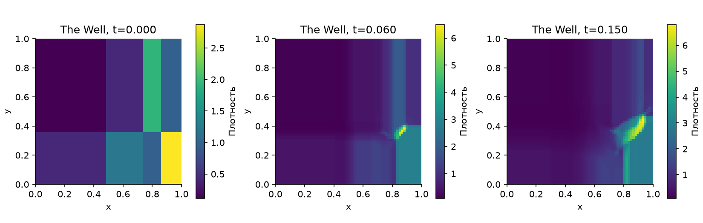
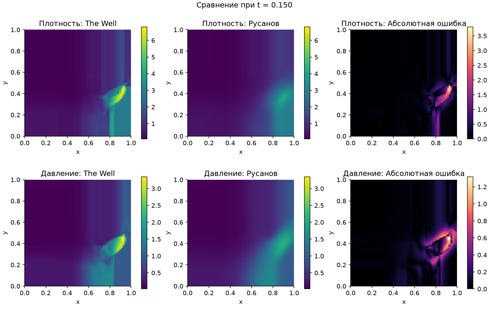
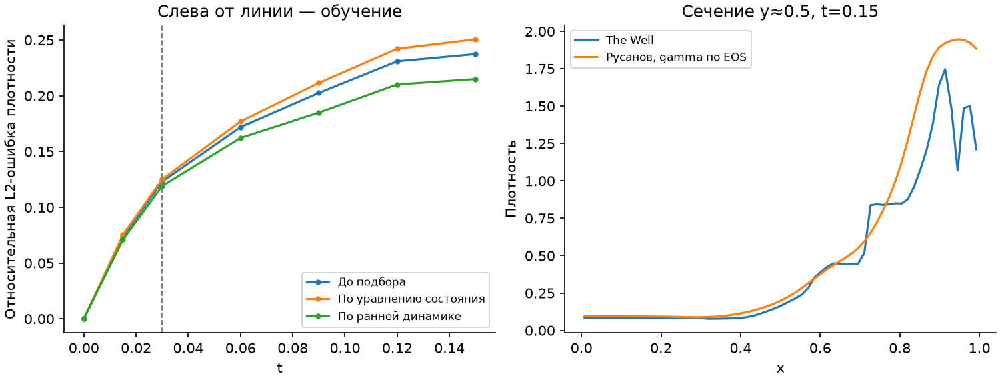
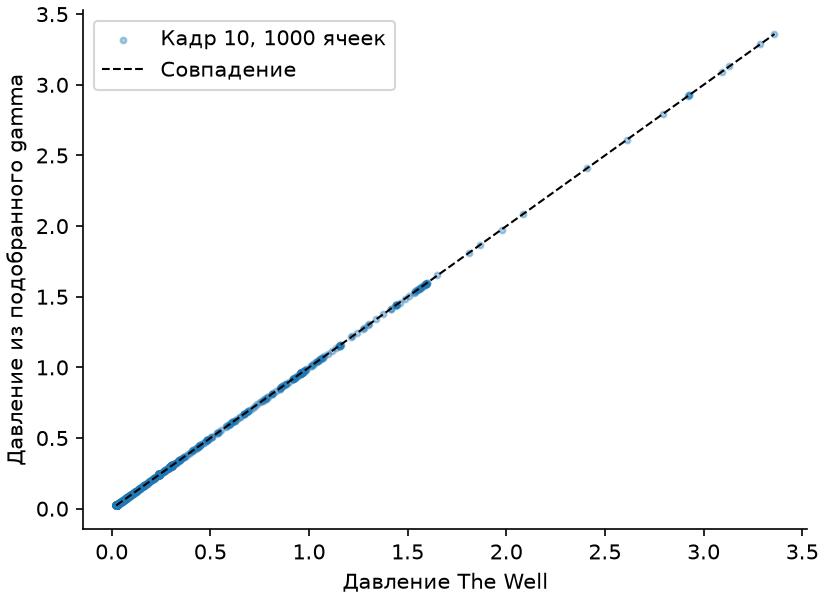
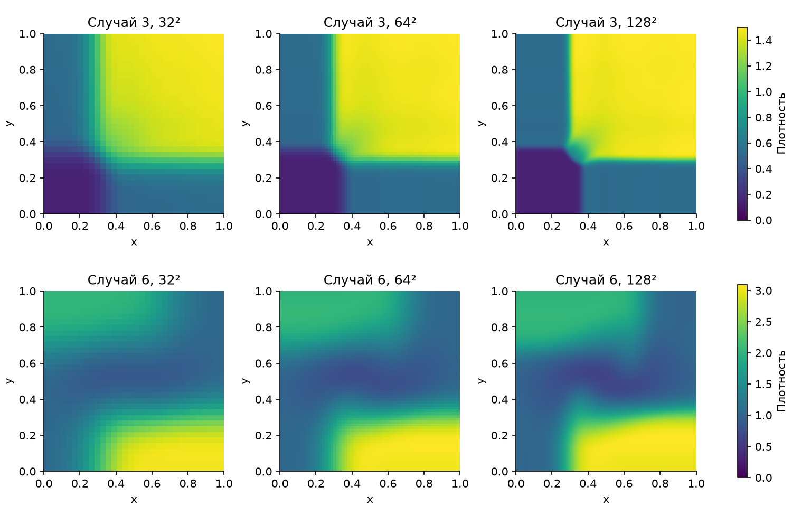
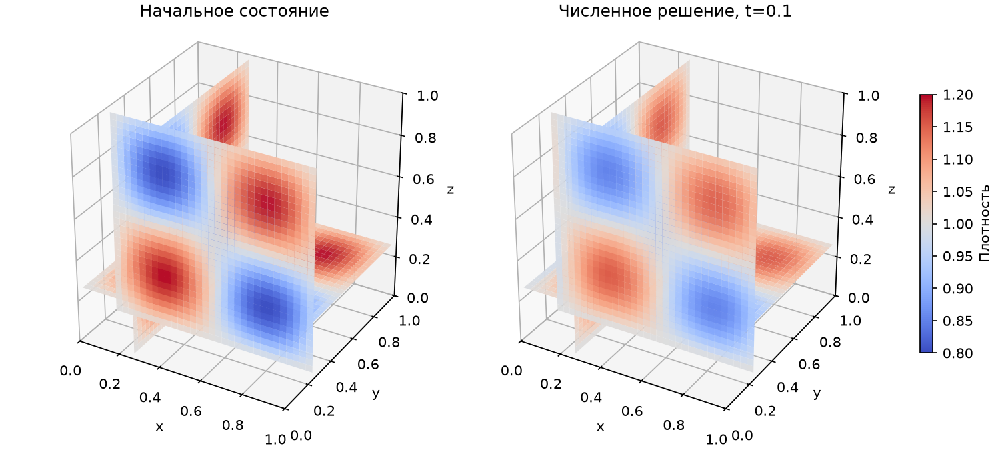
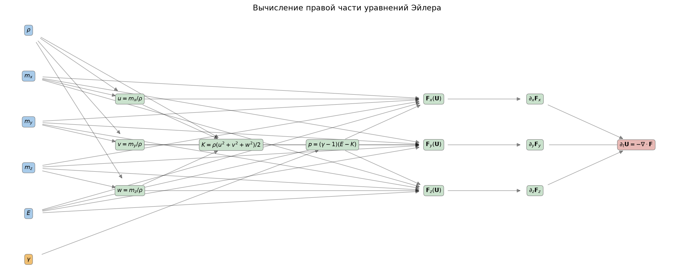

# Конспект к защите: задачи Римана для уравнений Эйлера

**Лабораторная работа 1, тема 11 — The Well: Euler Multi-quadrants.**

Этот конспект объясняет именно работу из [репозитория](https://github.com/Dimundel/euler-quadrants-lab): её физический смысл, формулы, алгоритм, код и полученные результаты. Числа сверены с [metrics.json](../results/metrics.json). Здесь нет обещания идеального совпадения с данными: нужно понимать, что получилось и почему осталась ошибка.

Для чтения открой рядом [выполненный ноутбук](../notebooks/lab11.ipynb). Установленный Python понадобится только для практической части; сохранённые графики доступны сразу.

## Как подготовиться за вечер

План примерно на четыре часа с перерывами. Время ориентировочное: если формулы незнакомы, лучше потратить больше времени на смысл переменных и один шаг солвера.

| Время | Что делать | Проверка понимания |
|---|---|---|
| 0:00–0:25 | Разделы 1–3: цель, газ, переменные | Объяснить разницу между плотностью, скоростью и импульсом |
| 0:25–1:00 | Разделы 4–7: уравнения, ячейки, поток, CFL | На бумаге объяснить, как получить следующий шаг |
| 1:00–1:10 | Перерыв | |
| 1:10–1:50 | Разделы 8–11: данные, усреднение, два подбора γ | Объяснить, почему получились два разных γ |
| 1:50–2:20 | Разделы 12–15: ошибки, графики, ANU, 3D | Правильно прочитать три главных результата |
| 2:20–2:30 | Перерыв | |
| 2:30–3:10 | Разделы 16–18: код, запуск, маршрут по ноутбуку | Найти в коде поток, шаг времени и функцию потерь |
| 3:10–3:40 | Разделы 19–20: короткий рассказ и вопросы | Ответить без чтения хотя бы на основные вопросы |
| 3:40–4:00 | Самопроверка и памятка в конце | Исправить места, где ответ пока заучен без понимания |

Если осталось только полтора часа: прочитай разделы **1, 3, 6, 7, 10–12, 15 и 19**, посмотри рисунок сравнения с The Well и ответь на вопросы про γ, 3D и погрешность. Это сокращённый маршрут, а не замена всей подготовки.

### Навигация

- [1. Что мы делаем](#purpose)
- [2. Что такое задача Римана](#riemann)
- [3. Переменные и единицы](#variables)
- [4. Уравнения Эйлера](#equations)
- [5. От формулы к сетке](#finite-volumes)
- [6. Поток Русанова](#rusanov)
- [7. Шаг времени и границы](#time-and-boundaries)
- [8. Какие данные мы используем](#data)
- [9. Почему усреднение требует аккуратности](#averaging)
- [10. Подбор γ по уравнению состояния](#eos-fit)
- [11. Подбор γ по динамике](#trajectory-fit)
- [12. Ошибки и результаты](#errors)
- [13. Как читать графики](#figures)
- [14. Второй источник: ANU](#anu)
- [15. Откуда берётся 3D](#three-dimensions)
- [16. Граф уравнений и устройство кода](#code)
- [17. Что проверяют тесты](#tests)
- [18. Запуск и демонстрация](#demo)
- [19. Рассказ для защиты](#defense)
- [20. Вопросы преподавателя](#questions)
- [21. Самопроверка](#self-check)
- [22. Памятка перед защитой](#cheat-sheet)
- [Источники](#sources)

<a id="purpose"></a>
## 1. Что мы делаем

У нас есть область, заполненная газом. Известно его начальное состояние: плотность, давление и скорость в каждой точке. Нужно вычислить, как это состояние изменится со временем.

Мы решаем **прямую задачу**:

```text
Начальное состояние + параметр газа + граничные условия
                         ↓
                 Численный солвер
                         ↓
              Состояние в следующие моменты
```

Затем решаем **обратную задачу**: имея наблюдаемые поля, подбираем параметр газа γ, чтобы модель лучше согласовывалась с ними.

Здесь два разных вида «модели»:

- **Физическая модель** — уравнения Эйлера идеального газа. Они определяют, какие процессы учитываются.
- **Численный метод** — схема конечных объёмов с потоком Русанова. Она приближённо реализует эти уравнения на компьютере.

Даже при правильной физической модели и правильном γ численный метод имеет погрешность. В этой лабораторной это особенно хорошо видно.

Что фактически сделано:

1. Загружен небольшой фрагмент The Well и независимые начальные условия ANU.
2. Реализован солвер с тремя пространственными направлениями.
3. Построен граф вычислений правой части уравнений.
4. Выполнены два вида подбора γ.
5. Сравнены расчёты с данными и с точным специальным решением.
6. Сохранены ошибки, графики и тесты.

Нейросетевая модель в расчёте не используется. Уравнения задаются явно, а оптимизатор подбирает один числовой параметр.

<a id="riemann"></a>
## 2. Что такое задача Римана

### Простейшая картина

Представь длинную трубу. В левой части газ имеет одно постоянное состояние, в правой — другое. В начальный момент между ними резкий переход. После начала взаимодействия появляются волны.

В одном измерении начальное условие записывается так:

$$
U(x,0)=\begin{cases}
U_L,&x<x_0,\\
U_R,&x>x_0.
\end{cases}
$$

Здесь «разрыв» означает скачок значений поля, например плотности. Это не разрыв массива, ошибка программы или обязательная физическая перегородка.

В двумерном классическом случае квадрат делят на четыре квадранта. В The Well используется более общее разбиение на несколько прямоугольных областей. Поэтому конкретная картинка The Well не обязана состоять ровно из четырёх частей.

### Какие структуры возникают

- **Ударная волна:** резкий переход, связанный со сжатием газа.
- **Волна разрежения:** область плавного расширения газа.
- **Контактный разрыв:** граница между состояниями с разной плотностью; в простом одномерном случае давление и скорость по обе стороны одинаковы.

В нескольких измерениях эти структуры взаимодействуют. Поэтому решить всю задачу одной короткой аналитической формулой обычно не получается. Определения и примеры волн можно посмотреть в [материале авторов Clawpack](https://www.clawpack.org/riemann_book/html/Euler.html).

### Конкретные начальные условия ANU, случай 3

В этой задаче разрывы находятся при x=0.5 и y=0.5, w=0, γ=1.4.

| Квадрант | Плотность ρ | Давление p | Скорость u вдоль x | Скорость v вдоль y |
|---|---:|---:|---:|---:|
| Верхний правый | 1.5000 | 1.5000 | 0 | 0 |
| Верхний левый | 0.5323 | 0.3000 | 1.2060 | 0 |
| Нижний левый | 0.1380 | 0.0290 | 1.2060 | 1.2060 |
| Нижний правый | 0.5323 | 0.3000 | 0 | 1.2060 |

Это числовые данные из [таблицы ANU](https://www.mso.anu.edu.au/fyris/lw2drtst03.html), сохранённые в [anu_cases.json](../data/processed/anu_cases.json). На защите можно показать таблицу и объяснить, что даже внутри одной задачи газ изначально неоднороден и уже может двигаться.

<a id="variables"></a>
## 3. Переменные: что именно хранит программа

### Понятные физические величины

| Обозначение | Смысл | Не путать |
|---|---|---|
| ρ, `rho` | Масса на единицу объёма, плотность | С массой всей области |
| u, v, w | Компоненты скорости по x, y, z | С координатами или импульсом |
| p | Давление | С параметром γ |
| mₓ, mᵧ, m_z | Компоненты плотности импульса: ρu, ρv, ρw | С массой |
| E | Полная энергия на единицу объёма | С удельной энергией на единицу массы |
| K | Энергия упорядоченного движения на единицу объёма | С полной энергией |
| γ, `gamma` | Показатель адиабаты газа | С шагом времени, CFL или скоростью |
| c | Локальная скорость звука | Со скоростью движения газа |
| Δx, Δy, Δz | Размеры ячейки | С числом ячеек |
| Δt | Внутренний шаг расчёта | С интервалом между сохранёнными кадрами |

Поля используются в численных единицах источников. Время модели восстановлено по карточке данных. Мы не выполняли полную размерную калибровку к килограммам, метрам и паскалям и не должны приписывать единицы СИ всем числам на графиках.

### Два представления одного состояния

**Примитивные переменные** удобны человеку:

$$W=(\rho,u,v,w,p).$$

**Консервативные переменные** удобны для расчёта законов сохранения:

$$U=(\rho,m_x,m_y,m_z,E).$$

Это одна и та же физическая информация при заданном γ. Последняя ось массива содержит пять компонент, но смысл этих компонент зависит от представления.

Переход из W в U:

$$m_x=\rho u,\quad m_y=\rho v,\quad m_z=\rho w,$$
$$K=\frac{\rho}{2}(u^2+v^2+w^2),\qquad E=\frac{p}{\gamma-1}+K.$$

Обратный переход:

$$u=m_x/\rho,\quad v=m_y/\rho,\quad w=m_z/\rho,$$
$$p=(\gamma-1)\left(E-\frac{m_x^2+m_y^2+m_z^2}{2\rho}\right).$$

### Маленький пример, который стоит посчитать руками

Пусть ρ=2, u=3, v=w=0, p=1 и γ=1.4. Это учебные числа, не отдельная строка датасета.

- Импульс по x: mₓ=2×3=6.
- Кинетическая энергия: K=2×3²/2=9.
- Внутренняя энергия на объём: p/(γ−1)=1/0.4=2.5.
- Полная энергия: E=9+2.5=11.5.
- Получаем U=(2,6,0,0,11.5).

Проверка обратно: p=0.4×(11.5−6²/(2×2))=0.4×2.5=1.

В коде это функции `primitive_to_conservative` и `conservative_to_primitive`. Отрицательные ρ и p не исправляются автоматически: программа сообщает об ошибке.

<a id="equations"></a>
## 4. Уравнения Эйлера: что означает запись

### Основные предположения

Газ рассматривается как сплошная среда. В данной постановке учитываются сжимаемость и перенос массы, импульса и энергии; вязкость, теплопроводность и внешние силы в солвер не включены. Замыкание соответствует идеальному газу с постоянным γ.

Для идеального газа γ — отношение теплоёмкостей при постоянном давлении и объёме. В используемом файле ожидается γ≈1.4. Это безразмерный параметр. Связь давления и внутренней энергии описана также в [разделе об уравнении состояния Clawpack](https://www.clawpack.org/riemann_book/html/Euler.html#Equation-of-state).

### Общая форма

$$
\frac{\partial U}{\partial t}
+\frac{\partial F_x(U)}{\partial x}
+\frac{\partial F_y(U)}{\partial y}
+\frac{\partial F_z(U)}{\partial z}=0.
$$

Как читать:

- ∂U/∂t — как меняется состояние со временем в фиксированном месте.
- Fₓ, Fᵧ, F_z — потоки сохраняющихся величин в трёх направлениях.
- Пространственные производные потоков описывают их дисбаланс.
- Если из маленького объёма уходит больше, чем приходит, количество внутри уменьшается.

Это система уравнений в частных производных: поля зависят сразу от нескольких координат и времени. После разбиения пространства на ячейки получается большая система для изменения значений во времени, которую мы интегрируем шаг за шагом.

### Потоки

$$
F_x=\begin{pmatrix}
m_x\\m_xu+p\\m_yu\\m_zu\\(E+p)u
\end{pmatrix},\quad
F_y=\begin{pmatrix}
m_y\\m_xv\\m_yv+p\\m_zv\\(E+p)v
\end{pmatrix},\quad
F_z=\begin{pmatrix}
m_z\\m_xw\\m_yw\\m_zw+p\\(E+p)w
\end{pmatrix}.
$$

Для понимания достаточно разобрать Fₓ:

1. `m_x = ρu`: перенос массы через поверхность с нормалью вдоль x.
2. `m_x*u + p`: перенос x-импульса и действие давления.
3. `m_y*u`, `m_z*u`: перенос поперечного импульса движением вдоль x.
4. `(E+p)*u`: перенос полной энергии и работа давления.

Поэтому даже при нулевой начальной скорости неодинаковое давление может изменить импульс. Газ не обязан двигаться изначально, чтобы движение началось.

В трёх измерениях пять законов сохранения: один для массы, три для импульса, один для энергии. Давление восстанавливается из уравнения состояния, а не эволюционирует как шестая независимая сохраняемая величина.

### Почему допустимы скачки

На ударном фронте обычная производная поля может не существовать. Законы сохранения при этом понимаются в интегральном смысле: баланс должен выполняться на конечном объёме. Это одна из причин использовать консервативный численный метод.

Важно различать два одноимённых понятия: **уравнения Эйлера** — физическая система, а **явный шаг Эйлера по времени** — способ обновления численного решения. В нашей реализации присутствуют оба, но это разные вещи.

<a id="finite-volumes"></a>
## 5. Метод конечных объёмов

### Что находится в ячейке

Мы храним среднее U по маленькому объёму. Поэтому сумма `rho * объём ячейки` даёт дискретную массу области. Аналогично суммируются импульс и энергия.

У одной ячейки шесть граней: две по каждой пространственной оси. Через них обмениваются соседние состояния.

В одном измерении обновление выглядит так:

$$
U_i^{n+1}=U_i^n-\frac{\Delta t}{\Delta x}
\left(\widehat F_{i+1/2}-\widehat F_{i-1/2}\right).
$$

Здесь i — номер ячейки, n — номер внутреннего шага времени, а значок над F означает численный поток через границу между ячейками.

В 3D добавляются аналогичные разности по y и z:

$$
U^{n+1}_{i,j,k}=U^n_{i,j,k}
-\frac{\Delta t}{\Delta x}(\widehat F^x_{i+1/2,j,k}-\widehat F^x_{i-1/2,j,k})
-\frac{\Delta t}{\Delta y}(\widehat F^y_{i,j+1/2,k}-\widehat F^y_{i,j-1/2,k})
-\frac{\Delta t}{\Delta z}(\widehat F^z_{i,j,k+1/2}-\widehat F^z_{i,j,k-1/2}).
$$

Все три вклада вычисляются по одному текущему состоянию, затем складываются. Именно поэтому схема называется **нерасщеплённой**.

### Пример баланса массы

Пусть ρ=1, Δx=0.1, Δt=0.01. Слева поток массы равен 0.3, справа — 0.1.

$$\rho_{new}=1-\frac{0.01}{0.1}(0.1-0.3)=1.02.$$

Пришло больше, чем ушло, поэтому плотность выросла. Если поменять потоки местами, плотность уменьшится.

### Почему сохраняется сумма

Одна и та же величина потока через общую грань вычитается из левой ячейки и прибавляется в правую. При суммировании по области внутренние вклады сокращаются. Остаются потоки через внешнюю границу.

Отсюда важное различие:

- При **периодических границах** внешние потоки тоже попарно сокращаются, и сумма сохраняется с точностью округления.
- При **открытых границах** масса или энергия могут уходить из области. Изменение суммы само по себе не означает нарушение закона сохранения: его надо сопоставлять с граничным потоком.

<a id="rusanov"></a>
## 6. Как устроен поток Русанова

На границе известны два состояния: U_L слева и U_R справа. Их нужно превратить в один поток.

$$
\widehat F(U_L,U_R)=\frac{F(U_L)+F(U_R)}{2}
-\frac{\alpha}{2}(U_R-U_L).
$$

Первое слагаемое усредняет физические потоки. Второе добавляет численную диссипацию, связанную со скачком состояния.

Коэффициент α выбирается по максимальной оценке скорости распространения возмущений у грани:

$$\alpha=\max(|v_{n,L}|+c_L,\ |v_{n,R}|+c_R),\qquad
c=\sqrt{\gamma p/\rho}.$$

Здесь vₙ — компонента скорости вдоль нормали к грани, а не модуль всей скорости. Для грани по x берётся u, по y — v, по z — w. Скорость звука вычисляется отдельно для каждого состояния.

Функция в коде называется `rusanov_flux`. Не путай её с `flux`: последняя возвращает физический поток для одного состояния, без пары соседей и стабилизирующего слагаемого.

### Почему решение получается размытым

Численная диссипация помогает работать с резкими переходами, но сглаживает их. На грубой сетке контактные разрывы и узкие пики теряют резкость. Это видно на наших рисунках.

**Численная диффузия не равна физической вязкости.** Вязкость в уравнения мы не добавляли. Размывание появляется из-за выбранного способа дискретизации.

В текущем коде состояние внутри ячейки считается постоянным, а время обновляется явным шагом первого порядка. Поэтому весь метод имеет первый порядок на достаточно гладких решениях в подходящем режиме измельчения сетки. На разрывах простое рассуждение о гладкой погрешности уже неприменимо.

Если слева и справа одно и то же состояние, скачок U_R−U_L равен нулю. Численный поток совпадает с физическим — полезная проверка реализации.

Что можно улучшить в дальнейшем: измельчить сетку, добавить реконструкцию более высокого порядка с ограничителями или более точный решатель на грани. Эти улучшения **не реализованы** в данной лабораторной.

<a id="time-and-boundaries"></a>
## 7. Шаг времени, CFL и граничные условия

### Для чего нужен CFL

Слишком большой явный шаг времени может сделать расчёт неустойчивым. Шаг ограничивают, учитывая размеры ячеек и скорости распространения волн.

В нашем коде:

$$
a_x=\max_{cells}(|u|+c),\quad
a_y=\max_{cells}(|v|+c),\quad
a_z=\max_{cells}(|w|+c),
$$
$$
\Delta t=\frac{\mathrm{CFL}}{a_x/\Delta x+a_y/\Delta y+a_z/\Delta z}.
$$

Выбрано `CFL = 0.4`. Суммируются только активные направления: ось с одной ячейкой пропускается. В плоском расчёте с четырьмя одинаковыми слоями по z эта ось всё же участвует в ограничении шага; её пространственный вклад при одинаковых слоях равен нулю.

Простой **одномерный** пример: Δx=0.01, максимальная скорость |u|+c=2, CFL=0.4. Тогда Δt=0.4×0.01/2=0.002. В многомерном случае нужно использовать сумму направлений, как в формуле выше.

CFL=0.4 — численная настройка. Мы её не подбирали как свойство газа. Уменьшение CFL означает меньшие шаги и обычно больше вычислений; само по себе оно не устраняет пространственное сглаживание.

### Кадр и внутренний шаг — разные вещи

У нас сохранены моменты 0, 0.015, 0.03, 0.06, 0.09, 0.12, 0.15. Между двумя сохранёнными моментами солвер может сделать много внутренних шагов. Последний шаг сокращается, чтобы попасть в нужное время вывода.

**0.015 — принятый интервал записи исходных кадров, а не фиксированный шаг нашего интегратора.**

### Границы

В работе с The Well используются:

- `outflow` по x и y: фиктивная ячейка за краем копирует ближайшую внутреннюю. Это простое продолжение значения за границу, а не стенка.
- `periodic` по z: соседом первого слоя считается последний и наоборот.

Для гладкой объёмной волны все три направления периодические. В ANU по x/y используются открытые границы.

На защите достаточно объяснить назначение фиктивных ячеек: они позволяют одинаково считать потоки у внутренних и внешних граней.

<a id="data"></a>
## 8. Какие данные использованы

### The Well

Это опубликованные результаты численного моделирования. Наш внешний ориентир получен другим программным расчётом; это не лабораторные измерения и не точное аналитическое решение.

Выбраны `euler_multi_quadrants_openBC`, файл для γ≈1.4, траектория 0. В [официальной карточке](https://polymathic-ai.org/the_well/datasets/euler_multi_quadrants_openBC/) описаны поля плотности, энергии, давления и импульса, двумерная сетка и способ генерации Clawpack.

Использованный фрагмент:

| Параметр | Значение |
|---|---|
| Исходная пространственная сетка | 512×512 |
| Сетка сохранённой выборки | 64×64, блоки 8×8 |
| Исходные номера кадров | 0, 1, 2, 4, 6, 8, 10 |
| Принятые времена | 0; 0.015; 0.03; 0.06; 0.09; 0.12; 0.15 |
| Число выбранных траекторий | 1 |
| Форма `conserved` | (7,64,64,5) |
| Порядок компонент | ρ, mₓ, mᵧ, m_z=0, E |
| Обучение по EOS | 1000 исходных ячеек кадра 2 |
| Проверка по EOS | 1000 исходных ячеек кадра 10 |

Для EOS берутся одни и те же выбранные пространственные индексы в разные моменты времени. Это проверка на более позднем кадре той же траектории, а не независимая выборка нового газа. Случайный выбор индексов зафиксирован `seed=11`.

### ANU / Fyris

Второй источник — опубликованные таблицы начальных условий для задач Римана. Загружены случаи 3, 6 и 12, но в показанных расчётах используются **3 и 6**.

От ANU мы получили числа в начальный момент. Последующее движение вычисляет наш солвер. Готовую численную траекторию ANU мы не загружали и по картинке сайта количественную ошибку не считали.

Это важно для формулировки результата: есть два независимых источника входных данных, но только один внешний набор временных полей для количественного сравнения — выбранный фрагмент The Well.

### Как устроена загрузка

`download_data.py` обращается к источникам по HTTPS. HDF5 — контейнер для массивов и метаданных. Полный выбранный файл занимает около 5.3 GB, но HTTP Range позволяет запросить только нужные диапазоны байтов.

Фактически загружено 57 671 680 байт HDF5, то есть около 57.7 MB. Для него задан предел 100 MB и проверяется ответ `206 Partial Content`. Полный ответ `200` отклоняется, чтобы случайно не получить весь файл. Небольшие страницы ANU загружаются отдельно.

Обработанная выборка занимает около 172 KB благодаря выбору полей/кадров, усреднению и сжатию. `sources.json` содержит точные URL, фиксированную версию The Well и контрольные суммы. SHA-256 помогает обнаружить изменение сохранённого файла; он не доказывает физическую правильность данных.

### Оговорки, которые уже есть в работе

1. Временная ось HDF5 содержит индексы 0…100 без собственного атрибута dt. Принята интерпретация t=0.015k по карточке.
2. Исходные координатные метки включают оба конца [0,1] с шагом 1/511. Наши конечные объёмы покрывают [0,1] с шагом 1/N. Это документированное соглашение, а не доказанная идеальная согласованность исходной геометрии.
3. Атрибут количества траекторий ошибочен (`−1550`); использована фактическая форма массива — 10 траекторий в файле.
4. Анализируется короткий фрагмент одной траектории. Обобщение на весь набор не проверено.

<a id="averaging"></a>
## 9. Почему нельзя просто усреднить всё подряд

На равномерной сетке среднее консервативных величин по блоку сохраняет суммарную массу, импульс и энергию этого блока при правильном учёте нового объёма.

Но давление зависит от состояния нелинейно:

$$p(U)=(\gamma-1)\left(E-\frac{|m|^2}{2\rho}\right).$$

Поэтому в общем случае

$$p(\overline U)\ne\overline{p(U)}.$$

### Пример на двух ячейках

Пусть в обеих ячейках ρ=1, p=1, γ=1.4. В одной u=+1, в другой u=−1; остальные скорости нулевые.

Для каждой: K=0.5, внутренняя энергия=2.5, полная E=3. Среднее исходного давления равно 1.

После объединения двух ячеек средние значения: ρ=1, mₓ=0, E=3. Тогда восстановленное давление грубой ячейки:

$$p(\overline U)=0.4(3-0)=1.2.$$

Мы потеряли разрешение противоположных скоростей внутри блока. Их энергия не исчезла из полного E, но теперь не представлена энергией среднего движения.

Что сделано в лабораторной:

- Для сравнения решений на сетке 64² давление эталона восстановлено из усреднённого U.
- Среднее исходного p сохранено отдельно для диагностики.
- Для EOS-подбора γ используются **исходные неусреднённые ячейки**.

Если подбирать γ по смеси «усреднённые ρ,m,E» и «среднее исходное p», можно получить ложное смещение даже без ошибки оптимизатора. В примере выше получилось бы γ=1+1/3≈1.3333 вместо 1.4.

<a id="eos-fit"></a>
## 10. Первый подбор: γ по уравнению состояния

### Что известно и что неизвестно

В выбранных ячейках известны ρ, m, E и p. Подбирается одно число γ — то есть вектор параметров θ=(γ) имеет длину один.

Введём внутреннюю энергию на объём:

$$z_i=E_i-\frac{|m_i|^2}{2\rho_i}.$$

Тогда модель давления:

$$p_i\approx(\gamma-1)z_i.$$

Остаток — разность предсказанного и наблюдаемого давления:

$$r_i(\gamma)=(\gamma-1)z_i-p_i.$$

Минимизируем сумму квадратов:

$$\gamma_* = \arg\min_{1.05\le\gamma\le1.9}\sum_i r_i(\gamma)^2.$$

В [analysis.py](../src/euler_lab/analysis.py) используется `scipy.optimize.least_squares`. Начальное приближение — 1.3, границы — [1.05,1.9]. Перед оптимизацией остатки масштабируются общей величиной; это не меняет положение минимума. Документация метода: [SciPy least_squares](https://docs.scipy.org/doc/scipy/reference/generated/scipy.optimize.least_squares.html).

### Почему это не сложная идентификация неизвестной физики

Задача линейна относительно a=γ−1. Без ограничений её можно решить напрямую:

$$a_* = \frac{\sum_i z_i p_i}{\sum_i z_i^2},\qquad \gamma_*=1+a_*.$$

При ограничениях на γ результат для этой выпуклой квадратичной задачи ограничивается допустимым интервалом. Общий оптимизатор здесь удобен как демонстрация процедуры подбора и соответствует заданию, но не является математически необходимым.

### Результат

- Ожидалось γ≈1.4.
- Получено **1.3999999784**.
- RMSE давления на обучении: **1.93×10⁻⁸**.
- RMSE на проверочном кадре: **2.25×10⁻⁸**.

Исходные поля созданы симулятором с таким уравнением состояния, поэтому почти точное восстановление ожидаемо. Малое отклонение связано с конечной точностью сохранённых полей и вычислений, а не с измерением γ до восьмого знака в физическом эксперименте.

В исходном файле γ хранится с ограниченной точностью и читается примерно как 1.399999976. На защите нужно говорить **γ≈1.4**, а не придавать физический смысл всем цифрам.

Ожидаемое значение известно нам из метаданных для проверки. Оно также используется при построении эталонного давления после усреднения. Поэтому вся постановка — контролируемая проверка метода на известных данных, а не полностью слепое определение неизвестного газа.

<a id="trajectory-fit"></a>
## 11. Второй подбор: γ по движению газа

Теперь одного подставления в формулу недостаточно: для каждого кандидата γ запускается весь солвер.

```text
Кандидат γ
   ↓
Начальное примитивное состояние → расчёт до ранних кадров
   ↓
Сравнение плотности и давления с эталоном
   ↓
Число: функция потерь
   ↓
Оптимизатор выбирает следующий γ
```

### Как устроена функция потерь

Обучающие моменты — t=0.015 и t=0.03. Начальный кадр в ошибку не входит, потому что он задан солверу.

Для каждого канала, плотности и давления, вычисляется одна общая RMS-величина по обучающим кадрам и ячейкам:

$$s_\rho=\sqrt{\langle\rho_{ref}^2\rangle},\qquad
s_p=\sqrt{\langle p_{ref}^2\rangle}.$$

Потери — средний квадрат нормированных отклонений двух каналов:

$$J(\gamma)=\frac12\left\langle
\left(\frac{\rho_{pred}(\gamma)-\rho_{ref}}{s_\rho}\right)^2+
\left(\frac{p_{pred}(\gamma)-p_{ref}}{s_p}\right)^2
\right\rangle.$$

Нормирование делает вклады каналов сопоставимыми по масштабу. Это не процентная ошибка в каждой отдельной ячейке.

Используется `minimize_scalar(method="bounded")`, интервал [1.05,1.9], допуск по параметру 0.005, максимум 20 итераций. В сохранённом запуске было **7 вычислений функции потерь**. Это семь запусков солвера для оптимизации, а не семь внутренних шагов времени. Документация: [SciPy minimize_scalar](https://docs.scipy.org/doc/scipy/reference/generated/scipy.optimize.minimize_scalar.html).

Успех оптимизатора не доказывает единственность или физическую правильность найденного параметра. Например, однородное неподвижное состояние почти ничего не расскажет о γ по динамике.

### Что фиксируется при переборе γ

Фиксировано начальное **примитивное** состояние W=(ρ,u,v,w,p). Для каждого кандидата γ начальная полная энергия вычисляется заново:

$$E_0(\gamma)=\frac{p_0}{\gamma-1}+K_0.$$

Если одновременно фиксировать E и p, а менять γ, можно нарушить уравнение состояния. В нашей реализации этого нет.

### Что получилось

Оптимизатор вернул **γ≈1.11848**, а обучающие потери — около **0.00918**.

Это число ниже физически ожидаемого 1.4. Причина для интерпретации: оптимизатор видит совокупную ошибку конкретного расчёта. На неё влияют численная диффузия, грубая сетка, выбранные поля/кадры и соглашения о сравнении. Изменение γ может частично компенсировать эту ошибку.

Мы не провели отдельный эксперимент, который доказал бы долю каждого из этих факторов. Корректно назвать γ≈1.11848 **параметром, оптимальным для данной процедуры подбора**, а не новым свойством исходного газа.

Проверка выполняется на t=0.06,0.09,0.12,0.15. Эти кадры не входят в подбор по динамике. Это временное разделение внутри одной траектории; отдельные независимые траектории для проверки обобщения не использованы.

<a id="errors"></a>
## 12. Метрики: как мы измеряем ошибку

Пусть y — эталонные значения, а ŷ — наши. Все суммы ниже берутся по выбранным элементам массива: ячейкам и, когда нужно, кадрам.

**MAE — средняя абсолютная ошибка:**

$$\mathrm{MAE}=\frac1N\sum_i|\hat y_i-y_i|.$$

**RMSE — корень из средней квадратичной ошибки:**

$$\mathrm{RMSE}=\sqrt{\frac1N\sum_i(\hat y_i-y_i)^2}.$$

**Относительная L2-ошибка:**

$$\varepsilon_{rel}=\frac{\sqrt{\sum_i(\hat y_i-y_i)^2}}{\sqrt{\sum_i y_i^2}}.$$

RMSE сильнее реагирует на большие отклонения. Относительная L2 нормируется на величину эталона и удобна для сравнения масштабов.

### Пример

Для y=(1,2) и ŷ=(1,1.8): MAE=0.1, RMSE≈0.1414, относительная L2=0.2/√5≈8.94%.

Ошибка 8.94% здесь не означает, что ошибочны 8.94% точек. В примере всего две точки. Это отношение норм массивов.

### Наши результаты на четырёх поздних кадрах

| Выбор γ | γ | RMSE плотности | rel.L2 плотности | RMSE давления | rel.L2 давления |
|---|---:|---:|---:|---:|---:|
| Начальное приближение | 1.3 | 0.24762 | 21.47% | 0.13113 | 20.75% |
| По уравнению состояния | ≈1.4 | 0.25938 | 22.49% | 0.13846 | 21.92% |
| По ранней динамике | ≈1.11848 | 0.22626 | 19.62% | 0.12899 | 20.42% |

Два полезных сравнения:

- По сравнению с γ≈1.4 динамический подбор уменьшил ошибку плотности на **2.87 процентного пункта**, или примерно на **12.77% относительно прежней ошибки**.
- По сравнению с начальным γ=1.3 уменьшение составило **1.85 процентного пункта**, или **8.63% относительно прежней ошибки**.

Нельзя смешивать процентные пункты и относительное уменьшение. Нельзя также сказать, что γ≈1.4 улучшил динамический расчёт: в этой таблице он хуже начального γ=1.3, хотя правильно восстанавливает параметр термодинамического замыкания.

Разумный вывод: подбор по ранней динамике улучшил метрику поздних кадров в данном эксперименте, но погрешность остаётся существенной. Это результат сравнительного расчёта, а не доказательство высокой точности солвера в общем случае.

<a id="figures"></a>
## 13. Как читать графики

### Исходные данные во времени



Каждая картинка — поле плотности на плоскости x,y. Цвет показывает значение, а не направление движения. У этих трёх картинок отдельные цветовые шкалы, поэтому сравнивать величины нужно по числам на шкалах, а не только по оттенку.

В начальном кадре видны кусочно-постоянные области. Позже около границ появляются движущиеся структуры.

### Сравнение с нашим расчётом



- Строка сверху: плотность; снизу: давление.
- Слева: обработанные данные The Well.
- Посередине: наш расчёт с γ, полученным по EOS.
- Справа: абсолютная разность.

Шкалы данных и расчёта одинаковы внутри каждой строки. Наша схема даёт более широкие и менее резкие пики. Ошибка концентрируется около сложных фронтов, а не обязательно равномерно по всей области.

Эта картинка относится к **γ по EOS**, не к динамически подобранному γ. Для сравнения всех трёх вариантов используй таблицу и следующий график.

### Ошибка во времени и сечение



Слева каждая линия соответствует своему γ. Вертикальная пунктирная линия отмечает конец обучающего интервала. В нулевом кадре ошибка почти нулевая по построению: всем вариантам дано одно начальное состояние.

Справа показана плотность вдоль x при фиксированном y≈0.5. Это один разрез поля, а не среднее по всей области. Он помогает увидеть сглаживание и смещение структуры, но не заменяет общую метрику.

### Подбор по EOS



По горизонтали — давление из The Well, по вертикали — давление из уравнения состояния с подобранным γ. При идеальном совпадении точки лежат на диагонали. Почти точная диагональ говорит о согласованности термодинамических полей, но сама по себе ничего не гарантирует о временном прогнозе.

<a id="anu"></a>
## 14. Зачем нужен второй источник ANU

Одна траектория The Well не показывает, как программа ведёт себя на других начальных условиях. Поэтому мы отдельно решаем случаи 3 и 6 из таблиц ANU при γ=1.4 и t=0.3.

Для каждого случая считаются сетки 32²,64²,128². Чтобы сравнить разное число ячеек, результат 128² усредняется по консервативным переменным до размера сравниваемой сетки.



| Случай ANU | Ошибка плотности 32² относительно усреднённого 128² | Ошибка 64² относительно усреднённого 128² |
|---|---:|---:|
| 3 | 9.11% | 4.30% |
| 6 | 8.97% | 4.03% |

При измельчении сетки согласование улучшается, а структуры становятся резче.

Но обе сравниваемые стороны получены нашим методом. Поэтому это **проверка сеточной согласованности**, а не измерение ошибки относительно точного решения. Сетка 128² тоже содержит численную диффузию.

Здесь используется один слой по z: состояние плоское, и вклад третьего направления отсутствует. Независимая проверка третьего направления выполняется отдельно.

<a id="three-dimensions"></a>
## 15. Как выполнена трёхмерная часть

### Что сделали с внешними двумерными данными

В общей методичке написано «3D плюс время», но выбранная тема The Well содержит 2D-поля. Мы построили солвер полной 3D-системы, а исходные плоские данные вложили в него так:

$$U(x,y,z,t)=U_{2D}(x,y,t),\qquad w=0.$$

На сетке The Well сделаны четыре одинаковых слоя по z. Производная по z равна нулю, поэтому это допустимый частный случай 3D-уравнений. Однако новой информации о пространственной динамике такое повторение не создаёт.

**Оговорка для защиты:** независимых внешних 3D-данных в работе нет. Если преподаватель требует именно их, нужно согласовать допустимость выбранного плоского вложения и отдельного аналитического теста. Нельзя говорить, что исходный The Well был трёхмерным.

### Полноценная объёмная проверка

Используется гладкое точное решение:

$$\rho(x,y,z,t)=1+0.2\sin(2\pi(x-0.3t))\sin(2\pi(y+0.2t))\sin(2\pi(z-0.1t)),$$
$$u=0.3,\quad v=-0.2,\quad w=0.1,\qquad p=1.$$

Поле плотности зависит от всех трёх координат. Скорость и давление постоянны, границы периодические.

Почему это решение работает: форма плотности просто переносится со скоростью (0.3,−0.2,0.1), поэтому выполняется

$$\partial_t\rho+\mathbf v\cdot\nabla\rho=0.$$

При постоянных p и скорости законы импульса и энергии согласуются с этим переносом. Это специальная точная задача для проверки реализации, а не скачанная траектория.

### Зачем в коде `sinc`

Солвер хранит средние по ячейкам. Значение синуса в центре не совсем равно его среднему по ячейке. Для этой волны точное среднее получается умножением амплитуды на

$$\operatorname{sinc}(1/N)^3,\qquad \operatorname{sinc}(s)=\frac{\sin(\pi s)}{\pi s}.$$

Именно такое определение использует `np.sinc`. Учитывая его, мы не смешиваем ошибку солвера с ошибкой задания начального или эталонного среднего.



На рисунке видны три пространственных сечения. Высота не кодирует плотность: плотность задана цветом.

| Сетка | RMSE плотности при t=0.1 | Максимальное изменение средних консервативных компонент |
|---|---:|---:|
| 16³ | 0.02795 | 9.77×10⁻¹⁵ |
| 32³ | 0.01594 | 1.04×10⁻¹³ |

Наблюдаемый порядок по двум сеткам:

$$p_{obs}=\log_2\left(\frac{0.027953}{0.015944}\right)\approx0.81.$$

Теоретически метод первого порядка, но две конечные сетки не обязаны давать ровно 1. Для уверенного исследования асимптотического порядка нужна серия более мелких сеток. Здесь зафиксировано уменьшение ошибки и наблюдаемая оценка 0.81.

Проверка сохранения использует средние компонентов U. Область имеет объём 1, поэтому эти средние соответствуют дискретным интегралам. Малые изменения порядка 10⁻¹³ связаны с округлением; они не означают, что само поле рассчитано с такой же точностью.

<a id="code"></a>
## 16. Граф уравнений и устройство программы

### Что означает граф



Входы: ρ,mₓ,mᵧ,m_z,E,γ. Из них последовательно получаются скорости, кинетическая энергия, давление, потоки, пространственные производные и ∂U/∂t.

Общие результаты переиспользуются. Например, давление одно и то же для всех трёх потоков. Граф показывает **зависимости вычислений**, а не траектории движения газа и не причинность, установленную статистическим анализом.

Граф построен через NetworkX и является DAG — ориентированным графом без циклов. Он описывает вычисление правой части в один момент. Повторение расчёта по времени выполняется внешним циклом программы.

В матрице зависимостей используется соглашение:

$$Z[i,j]=1,\quad\text{если узел j является входом для узла i}.$$

У NetworkX матрица смежности по умолчанию имеет другую ориентацию «источник→цель», поэтому в ноутбуке она транспонируется для показанного соглашения.

### Какие файлы нужно уметь найти

| Файл | Что делает | Что показать преподавателю |
|---|---|---|
| [solver.py](../src/euler_lab/solver.py) | Физические переменные, потоки, шаг по времени | `rusanov_flux`, `EulerSolver._rhs`, `EulerSolver.solve` |
| [analysis.py](../src/euler_lab/analysis.py) | DAG, EOS-подбор, усреднение, метрики | `fit_gamma`, `error_metrics`, `coarsen_conservative` |
| [calibration.py](../src/euler_lab/calibration.py) | Подбор γ по ранней динамике | Вложенную функцию `objective` |
| [data.py](../src/euler_lab/data.py) | HTTPS-загрузка, парсер ANU, проверки файлов | `HTTPRangeReader`, `download_well_sample` |
| [experiments.py](../src/euler_lab/experiments.py) | Начальные условия и точная 3D-волна | `quadrant_state`, `entropy_wave` |
| [plotting.py](../src/euler_lab/plotting.py) | Графики | Как задаётся общее цветовое сравнение |
| [run_lab.py](../scripts/run_lab.py) | Выполнение ноутбука и сохранение HTML | Команду запуска |

### Псевдокод солвера

Это сокращённое объяснение, а не дополнительная реализация:

```python
U = primitive_to_conservative(W_initial, gamma)
for target_time in output_times[1:]:
    while current_time < target_time:
        W = conservative_to_primitive(U, gamma)
        dt = step_from_cfl(W, spacing)
        dt = min(dt, target_time - current_time)
        dU_dt = sum_flux_differences(U, boundary, spacing)
        U = U + dt * dU_dt
        check_positive_density_and_pressure(U)
        current_time += dt
    save(conservative_to_primitive(U, gamma))
```

При чтении настоящего кода найди эти действия, а не пытайся запомнить каждую строку.

### Формы массивов

- Одно 3D-примитивное состояние: `(nx,ny,nz,5)`.
- Вся траектория солвера: `(nt,nx,ny,nz,5)`.
- Для основной задачи: `(7,64,64,4,5)`.
- `solution[frame, :, :, 0, 0]` — плотность выбранного кадра в первом слое z.
- `solution[..., 4]` — давление, потому что `solve` возвращает примитивные переменные.
- `sample['conserved'][..., 4]` — энергия: это другой тип состояния.

Последний пункт часто вызывает ошибки. Номер компоненты сам по себе не говорит, что в ней лежит: нужно знать представление массива.

<a id="tests"></a>
## 17. Что проверяют 61 тест

Сохранённая работа прошла 61 тест:

| Группа | Число | Примеры смысла |
|---|---:|---|
| `test_solver.py` | 9 | Обратимость преобразований, физический поток, однородное состояние, сохранение при периодических границах, перестановка осей, перенос вдоль z |
| `test_analysis.py` | 41 | Граф, восстановление γ на контролируемых данных, метрики, усреднение, продолжение по z, отклонение некорректных входов |
| `test_calibration.py` | 3 | Подбор на синтетической траектории собственного солвера, исключение начального кадра из потерь, проверка допустимых времён |
| `test_data.py` | 8 | Разбор числовых таблиц и проверки загрузчика/данных |

Количество 41 в анализе включает несколько вариантов входов для похожих проверок, а не 41 независимый физический эксперимент.

Особенно важно различать:

- **Тест преобразований** проверяет, что W→U→W возвращает исходные значения.
- **Тест сохранения** проверяет дискретный баланс при подходящих границах.
- **Подбор на данных собственного солвера** проверяет работоспособность процедуры оптимизации, но не независимую физическую точность.
- **Сравнение с The Well и точной 3D-волной** измеряет численную погрешность на конкретных задачах.

Все тесты могут пройти, а численная ошибка поля остаться 20%. Здесь нет противоречия: корректно реализованный приближённый метод всё равно приближённый.

<a id="demo"></a>
## 18. Как запустить и что показывать

### Подготовка окружения

Нужен Python 3.12 для зафиксированного набора версий. Команды выполняются **из корня `euler-quadrants-lab`**.

```bash
python3 --version
python3 -m venv .venv
source .venv/bin/activate
python -m pip install -r requirements.txt
python -m pip install -e . --no-deps
python -m pytest -q
python scripts/run_lab.py
```

Первая команда должна показать нужную версию. Если `python3` указывает на старую, используй установленный Python 3.12 при создании окружения. В Windows активация — `.venv\Scripts\activate`.

Установка пакетов требует сети. Повторный расчёт использует уже сохранённую выборку. Для формул HTML может понадобиться доступ к MathJax. Оригинальные данные можно повторно скачать командой `python scripts/download_data.py`, но для демонстрации это не обязательно.

Результаты запуска: обновлённый ноутбук, `results/lab11.html`, восемь рисунков и `results/metrics.json`.

### Короткий вызов солвера, который можно выполнить самостоятельно

После установки пакета этот пример создаёт постоянное состояние и проверяет его сохранение:

```python
import numpy as np
from euler_lab.solver import EulerSolver

W = np.zeros((8, 8, 4, 5))
W[..., 0] = 1.0  # плотность
W[..., 4] = 1.0  # давление; все скорости равны нулю

result = EulerSolver(gamma=1.4).solve(
    W, times=[0.0, 0.1], spacing=(1/8, 1/8, 1/4)
)
print(result.shape)  # (2, 8, 8, 4, 5)
print(np.max(np.abs(result[-1] - W)))  # должно быть близко к нулю
```

Однородное состояние не меняется, поскольку потоки через противоположные грани сбалансированы. Одной такой проверки недостаточно для всего солвера, но она помогает понять его интерфейс.

### Маршрут по выполненным кодовым ячейкам

Номера ниже — `In [1]`…`In [12]` сохранённого ноутбука, не порядковые номера всех ячеек с текстом.

| Ячейка | Содержание | О чём говорить |
|---|---|---|
| 1 | Импорты и настройки | Функции вынесены в модули |
| 2 | Граф уравнений | Зависимости общих величин |
| 3 | Матрица зависимостей | Как прочитать Z[i,j] |
| 4 | Данные и контрольные суммы | Выборка, время, усреднённое давление |
| 5 | Три кадра The Well | Разрывы и движение структур |
| 6 | EOS-подбор | Получаем ожидаемое γ≈1.4 |
| 7 | Подбор по динамике и три прямых расчёта | Ранние кадры и фиксированное W₀ |
| 8 | Таблица поздних ошибок и карты | Количественный результат |
| 9 | Ошибка во времени и сечение | Сглаживание и интервал проверки |
| 10 | ANU на трёх сетках | Второй источник и сеточная согласованность |
| 11 | Полноценная 3D-волна | Точное решение, сходимость и сохранение |
| 12 | Сохранение метрик и выводы | Что проверено и какие ограничения остались |

Если на показ мало времени, выбери ячейки **5, 6, 8 и 11**, а код солвера открой отдельно. Не начинай демонстрацию с повторной загрузки многогигабайтного исходника.

<a id="defense"></a>
## 19. Основа рассказа на 2–3 минуты

Ниже связный вариант объяснения. Его лучше пересказать своими словами, а не читать с листа.

> Работа посвящена двумерным задачам Римана для уравнений Эйлера с реализацией солвера в трёх пространственных направлениях. В начальный момент газ разбит на области с постоянными, но различающимися плотностью, давлением и скоростью. Требуется вычислить дальнейшее движение.
>
> В качестве физической модели используются законы сохранения массы, трёх компонент импульса и полной энергии, замкнутые уравнением состояния идеального газа. Подбираемый параметр — показатель адиабаты γ.
>
> Численное решение получено методом конечных объёмов с потоком Русанова первого порядка. Через общую грань соседних ячеек используется один поток с противоположными знаками. Шаг времени определяется условием CFL.
>
> Данные взяты из двух источников. Из The Well получен фрагмент готовой численной траектории, а из ANU — опубликованные начальные условия. Поля The Well усреднены по консервативным переменным с 512² до 64².
>
> Выполнены два подбора γ. Из уравнения состояния восстановлено ожидаемое значение около 1.4. Подбор по двум ранним кадрам движения дал около 1.1185. На поздних кадрах второй вариант уменьшил относительную L2-ошибку плотности с 22.49% до 19.62% по сравнению с γ≈1.4. При этом γ≈1.1185 рассматривается как параметр настройки приближённого расчёта, а не истинное свойство исходного газа.
>
> На данных ANU проверено улучшение согласованности при измельчении сетки. Третье направление отдельно проверено на точной объёмной волне: ошибка уменьшается при переходе от 16³ к 32³, а периодические интегралы сохраняются до округления.
>
> Основные ограничения — численное сглаживание схемы первого порядка, короткий фрагмент одной траектории и исходно двумерные внешние данные. Поэтому работа демонстрирует проверенный численный эксперимент, но не высокоточную универсальную модель всего The Well.

Если спрашивают об участии ИИ, опирайся на [AI_USAGE.md](../AI_USAGE.md): помощь использовалась в подготовке кода, текста и проверок. Способность объяснить расчёт и его ограничения важнее попытки скрыть происхождение отдельных строк.

<a id="questions"></a>
## 20. Вопросы преподавателя

Ответы ниже относятся к выполненной лабораторной: `notebooks/lab11.ipynb`, модулям `src/euler_lab/` и сохранённым числам `results/metrics.json`. Их удобно использовать как опорные объяснения, но формулы и обозначения лучше понимать, а не заучивать дословно.

### 1. Какова цель работы одним предложением?

Мы численно моделируем движение идеального газа с разрывными начальными условиями, подбираем показатель адиабаты и сравниваем расчёт с опубликованными данными. Дополнительно проверяем поведение программы на других начальных условиях и на трёхмерной задаче с известным точным решением. Главный результат — не только картинки, но и измеренная ошибка вместе с объяснением её ограничений.

### 2. Что такое задача Римана и почему здесь квадранты?

В задаче Римана начальное состояние кусочно-постоянно: в каждой области плотность, скорость и давление заданы постоянными числами, а между областями есть разрыв. В классическом двумерном примере и используемых тестах ANU четыре области — это четыре четверти квадрата, или квадранта. В выбранном наборе The Well разбиение может содержать больше областей. После начала движения разрывы порождают волны, включая ударные волны, волны разрежения и контактные границы, которые взаимодействуют между собой.

### 3. Чем уравнения Эйлера отличаются от метода Эйлера и потока Русанова?

Уравнения Эйлера — физическая модель сохранения массы, импульса и энергии невязкого газа. Явный метод Эйлера — способ продвинуть численное решение на один шаг времени: взять текущее состояние и прибавить шаг времени, умноженный на рассчитанную скорость изменения. Поток Русанова — правило расчёта обмена через границу двух соседних ячеек. В работе используются все три понятия, но они отвечают за разные части расчёта.

### 4. Какие пять величин хранит солвер?

Он хранит консервативное состояние $U=(\rho,m_x,m_y,m_z,E)$: плотность, три компоненты плотности импульса и полную энергию на единицу объёма. Импульс связан со скоростью как $\mathbf m=\rho\mathbf v$, а полная энергия складывается из внутренней энергии газа и энергии его направленного движения. Для задания условий и построения графиков удобнее примитивные переменные $(\rho,u,v,w,p)$: плотность, три скорости и давление.

### 5. Что такое γ и что означает ожидаемое значение 1.4?

Для идеального газа $\gamma$ — показатель адиабаты, связанный с отношением теплоёмкостей $c_p/c_v$. Он определяет связь давления с внутренней энергией и влияет на скорость звука $c=\sqrt{\gamma p/\rho}$. Выбранный файл The Well создан с $\gamma\approx1.4$, поэтому это ожидаемое значение при восстановлении параметра из его полей. Это не шаг сетки, не коэффициент вязкости и не настройка точности программы.

### 6. Как работает схема конечных объёмов с потоком Русанова?

Область разделена на ячейки, и в каждой хранятся средние значения консервативных величин. Новое состояние определяется тем, сколько массы, импульса и энергии прошло через грани ячейки за шаг времени. Поток Русанова берёт среднее физических потоков слева и справа и добавляет сглаживающий член, зависящий от разности состояний и максимальной скорости распространения волн. Поэтому схема проста и пригодна для разрывов, но заметно размывает узкие структуры.

### 7. Зачем нужен CFL и почему шаг времени не постоянный?

Условие CFL связывает шаг времени с размерами ячеек и скоростями распространения волн: быстрые волны или мелкая сетка требуют меньшего шага. В нашей нерасщеплённой схеме ограничения всех активных направлений складываются: $\Delta t=0.4/(a_x/\Delta x+a_y/\Delta y+a_z/\Delta z)$, где $a_d$ — максимальная величина $|v_d|+c$. При подходе к нужному времени вывода шаг дополнительно сокращается, чтобы получить кадр именно в этот момент. Если расчёт всё же даёт неположительную плотность или давление, программа сообщает ошибку, а не заменяет их незаметно маленькими положительными числами.

### 8. Какие два источника данных использованы?

Первый источник — The Well: сохранённое численное решение, полученное другой программой, Clawpack. Второй — страницы ANU / Fyris с опубликованными числовыми начальными условиями задач Лиски — Вендроффа, в работе используются случаи 3 и 6. Из ANU загружены именно начальные значения в квадрантах, а последующие решения посчитаны нашим солвером. Поэтому ANU нельзя представлять как второй независимо загруженный массив готовых траекторий.

### 9. Какой именно фрагмент The Well взят и можно ли его восстановить?

Взята траектория 0 из выбранного test-файла для $\gamma=1.4$ и семь кадров: 0, 1, 2, 4, 6, 8 и 10. Поля размером $512\times512$ усреднены блоками $8\times8$ до $64\times64$, причём усредняются консервативные переменные. По HTTPS получено около 58 MB нужных диапазонов файла, а не весь HDF5 размером около 5.3 GB. Ссылка, фиксированная версия источника, способ обработки и контрольные суммы сохранены в манифесте; он подтверждает целостность включённых файлов, но не полную проверку всех байтов исходного HDF5.

### 10. Работа трёхмерная или всё-таки двумерная?

Сам солвер трёхмерный: он учитывает потоки по x, y и z и хранит все три компоненты импульса. Внешние данные The Well и ANU двумерные; для основного сравнения Well мы повторили плоское состояние одинаковыми слоями по z и положили $w=0$. Это допустимый частный случай трёхмерных уравнений, но повторение слоёв не создаёт новых наблюдений. Отдельная аналитическая волна зависит от всех трёх координат; независимых внешних 3D-данных в работе нет, и при строгом требовании именно таких данных вопрос остаётся предметом согласования с преподавателем.

### 11. Как проверена настоящая работа третьего направления?

Для этого используется трёхмерная энтропийная волна: плотность задана произведением синусов по x, y и z, а давление и скорость постоянны. При таких условиях точное решение получается переносом исходной плотности с постоянной скоростью, поэтому его можно вычислить без другого численного солвера. Мы сравниваем с ним расчёты на сетках $16^3$ и $32^3$ при $t=0.1$. Поскольку солвер хранит средние по ячейкам, в точной формуле учтён множитель $\operatorname{sinc}(1/N)^3$, а не просто взяты значения синусов в центрах ячеек.

### 12. Если схема консервативная, почему масса внутри области может изменяться?

Консервативность означает, что поток через общую грань вычитается у одной ячейки и прибавляется у другой: внутри области обмен согласован. При периодических границах противоположные края соединены, поэтому суммарные масса, импульс и энергия сохраняются с точностью округления. При открытых границах газ и энергия могут пересекать границу расчётной области, поэтому сумма внутри неё вправе изменяться. В этой работе сохранение интегралов до порядка $10^{-13}$ проверено именно на периодической трёхмерной волне, а не заявлено для любого расчёта с outflow.

### 13. Почему нельзя сначала усреднить давление и считать это тем же самым, что давление из среднего состояния?

Давление вычисляется как $p=(\gamma-1)(E-|\mathbf m|^2/(2\rho))$, а выражение с квадратом импульса нелинейно. Поэтому давление из усреднённых $\rho,\mathbf m,E$ обычно не равно среднему исходного давления. Для сравнения с солвером на грубой сетке используется давление, восстановленное из усреднённого консервативного состояния. А для подбора $\gamma$ по уравнению состояния используются исходные ячейки до усреднения, чтобы это преобразование не внесло лишнее смещение.

### 14. Насколько точно известны время и координаты исходных данных?

В HDF5 временная ось содержит индексы 0…100 без атрибута единицы времени; в работе принято $t=0.015k$ по интервалу записи из карточки источника. Исходные метки x и y включают оба конца отрезка $[0,1]$, поэтому их шаг равен $1/511$, а не шагу между центрами 512 конечных объёмов. Для нашего расчёта используется указанная в описании область $[0,1]$ и шаг $1/N$, а исходные метки сохранены отдельно. Это явно выбранные интерпретации метаданных, которые ограничивают точность сопоставления; они не доказывают восстановление всех физических единиц исходного эксперимента.

### 15. Как подбирался γ по уравнению состояния и можно ли обойтись без оптимизатора?

Обозначим внутреннюю энергию на единицу объёма через $q_i=E_i-|\mathbf m_i|^2/(2\rho_i)$; тогда остаток равен $(\gamma-1)q_i-p_i$. В коде `least_squares` минимизирует сумму квадратов таких остатков на 1000 исходных ячейках кадра 2, а проверка проводится на ячейках кадра 10. Задача линейна по $\gamma$, поэтому без ограничений её решение действительно можно записать явно: $\hat\gamma=1+\sum_iq_ip_i/\sum_iq_i^2$. При наших простых границах поиска результат этой формулы достаточно ограничить интервалом $[1.05,1.9]$; для одной точной ячейки формула ещё проще: $\gamma=1+p/q$. Численный оптимизатор здесь выбран как общий инструмент подбора, но математически необходимым он не является.

### 16. Чем подбор по движению газа отличается от подбора по уравнению состояния?

Теперь для каждого пробного $\gamma$ нужно заново решить уравнения и сравнить рассчитанные плотность и давление с кадрами при $t=0.015$ и $t=0.03$. `minimize_scalar` минимизирует среднюю квадратную ошибку этих двух полей после нормировки каждого на его RMS; начальный кадр в ошибку не входит. Для всех кандидатов сохраняется одно начальное примитивное состояние, а соответствующая ему начальная полная энергия пересчитывается с текущим $\gamma$. Кадры $t=0.06,0.09,0.12,0.15$ не участвуют в подборе и служат поздней проверкой.

### 17. Почему по уравнению состояния получилось 1.4, а по движению — 1.11848?

Первый способ восстанавливает параметр замыкания из полей, уже созданных симулятором идеального газа: получилось $1.399999978$, то есть практически ожидаемые 1.4. Второй способ выбирает параметр, с которым именно наша грубая схема лучше приближается к выбранным ранним кадрам, и получил $1.118484$. В эту оценку входят не только свойства газа, но и ошибки дискретизации, сглаживания и принятых преобразований данных. Поэтому значение 1.11848 нельзя объявлять новым истинным показателем адиабаты исходного газа, а точный вклад каждой причины смещения в работе не установлен.

### 18. Что означают ошибки 22.49% и 19.62%?

Это относительные L2-ошибки плотности по всем ячейкам четырёх поздних кадров: $\|\rho_{\rm calc}-\rho_{\rm ref}\|_2/\|\rho_{\rm ref}\|_2$. При $\gamma$ из уравнения состояния ошибка составляет 22.49%, а при $\gamma$, подобранном по ранней динамике, — 19.62%. Это не процент неправильных ячеек и не одинаковая относительная ошибка в каждой точке. Улучшение равно 2.87 процентного пункта; особенно большие локальные расхождения нужно смотреть отдельно на карте ошибки и сечениях.

### 19. Почему исходное γ=1.3 местами выглядит лучше правильного γ=1.4?

На этой сетке поздняя ошибка плотности для исходного $\gamma=1.3$ равна 21.47%, а для физически ожидаемого $\gamma\approx1.4$ — 22.49%. Это возможно, потому что несовершенная численная схема с немного неверным параметром может случайно лучше приблизить конкретные данные, частично компенсируя свою погрешность. Равенство параметра истинному значению и минимальная ошибка грубого численного расчёта — разные критерии. По этим числам нельзя делать вывод, что физическая модель требует заменить 1.4 на 1.3.

### 20. Зачем считать ANU на трёх сетках и является ли 128² эталоном?

Для случаев 3 и 6 сравниваются расчёты на $32^2$ и $64^2$ с усреднённым результатом той же схемы на $128^2$. Расхождение плотности уменьшается примерно с 9.11% до 4.30% в случае 3 и с 8.97% до 4.03% в случае 6. Это показывает улучшение согласованности при измельчении сетки на выбранных примерах. Решение $128^2$ само содержит ошибку, поэтому такое сравнение не даёт точной ошибки относительно истинного решения.

### 21. Почему наблюдаемый порядок 0.81, если схема первого порядка?

Для точной трёхмерной волны RMSE плотности уменьшилось с 0.02795 на $16^3$ до 0.01594 на $32^3$. Оценка $\log_2(e_{16}/e_{32})$ даёт около 0.81. Первый порядок описывает асимптотическое поведение при достаточно мелкой сетке, а здесь использованы всего две довольно грубые сетки и присутствует временная погрешность. Полученный результат показывает уменьшение ошибки, но не является строгим доказательством порядка сходимости на произвольных задачах.

### 22. Что показывает граф уравнений и его матрица?

Граф показывает зависимости при вычислении правой части: из плотности и импульса получаются скорости, затем кинетическая энергия и давление, далее три потока и их пространственные производные. Это направленный граф одного вычислительного шага, а не причинная модель реального мира и не нейросеть. В показанной матрице единица $Z[i,j]$ означает, что для вычисления узла i нужен узел j. Обратная связь, при которой новое состояние используется на следующем шаге времени, в этом графе специально не нарисована.

### 23. Что доказывают 61 пройденная проверка?

Набор тестов проверяет конкретные свойства программы: формулы потоков и преобразования переменных, сохранение постоянного состояния, периодическую консервативность, работу третьего направления, калибровку и обработку данных. Все 61 проверка прошла в использованном окружении. Это не означает, что проверены все возможные входы, что ошибка решения равна нулю или что схема точно воспроизводит весь The Well. Тесты уменьшают риск известных типов программных ошибок, а точность физического расчёта оценивается отдельными экспериментами.

### 24. Какие главные ограничения работы и что улучшать дальше?

Проверена одна короткая траектория The Well, два набора начальных условий ANU и одна гладкая аналитическая 3D-задача. Этого недостаточно для уверенного вывода о качестве на всём наборе данных, статистических доверительных интервалах параметра или надёжности в любой газодинамической задаче. Следующие содержательные шаги — взять больше независимых траекторий, проверить результаты на более мелких сетках и попробовать схему более высокого порядка, сохранив сравнение на кадрах, не использованных при подборе. Также полезно уточнить исходные метаданные времени и сетки; простое увеличение числа тестов эту неопределённость не устраняет.

### 25. Как честно объяснить участие ИИ и воспроизводимость результата?

Работа подготовлена с помощью OpenAI Codex: ИИ участвовал в модулях, тестах, ноутбуке и пояснениях, что записано в `AI_USAGE.md`. Внешние данные взяты из указанных источников, а числа и рисунки получены выполнением кода, а не придуманы как иллюстрация. На защите разумно объяснять то, что удалось понять и самостоятельно проверить, и прямо признавать непонятный момент вместо заявления об авторстве без помощи. Для воспроизведения сохранены зависимости, обработанные данные, команды запуска, промпты и сведения об использованных инструкциях.

<a id="self-check"></a>
## 21. Самопроверка: попробуй без подсказок

На первые семь заданий нужны бумага и калькулятор. На остальные отвечай вслух. Сначала сформулируй ответ, потом открой решение.

### Задание 1. Из давления в энергию

Дано: $\rho=2$, $u=3$, $v=w=0$, $p=1$, $\gamma=1.4$. Найди пять компонент $U$. Затем восстанови давление из полученного $U$.

<details>
<summary>Ответ и проверка</summary>

Плотность импульса $m_x=\rho u=6$. Кинетическая энергия на единицу объёма $K=\rho u^2/2=9$. Внутренняя энергия $q=p/(\gamma-1)=2.5$, поэтому $E=11.5$.

Получаем $U=(2,6,0,0,11.5)$. Обратная проверка: $p=0.4(11.5-6^2/(2\cdot2))=1$.

Если в пятой компоненте получилось 1, ты записал примитивное состояние, а не консервативное.

</details>

### Задание 2. Один шаг сохранения массы

В одномерной ячейке $\rho^n=1$, $\Delta x=0.1$, $\Delta t=0.01$. Поток массы через левую грань равен 0.3, через правую — 0.1. Оба потока определены положительными в направлении вправо. Какова новая плотность?

<details>
<summary>Ответ и проверка</summary>

$\rho^{n+1}=1-(0.01/0.1)(0.1-0.3)=1.02$.

Слева вошло больше, чем вышло справа, поэтому плотность выросла. Этот смысл помогает не перепутать знак.

</details>

### Задание 3. Выбор шага

Для одномерного примера $\Delta x=0.01$, максимальное $|u|+c=2$, CFL = 0.4. Найди $\Delta t$. Что изменится, если сделать ячейки вдвое меньше?

<details>
<summary>Ответ и проверка</summary>

$\Delta t=0.4\cdot0.01/2=0.002$. При той же скорости и вдвое меньшей ячейке шаг станет 0.001.

В полном солвере нужно учитывать сумму ограничений всех активных пространственных направлений. Одномерная формула здесь дана только для упражнения.

</details>

### Задание 4. Подбор γ без оптимизатора

В одной исходной ячейке известны $\rho=1$, $\mathbf m=(1,0,0)$, $E=3$, $p=1$. Какой показатель адиабаты согласуется с этими данными?

<details>
<summary>Ответ и проверка</summary>

$q=3-1^2/(2\cdot1)=2.5$, поэтому $\gamma=1+p/q=1.4$.

Это восстановление параметра из состояния. Запускать временную эволюцию для такого расчёта не нужно.

</details>

### Задание 5. Ловушка усреднения

Две равные ячейки: в обеих $\rho=1$, $p=1$, $\gamma=1.4$, но скорости $u=+1$ и $u=-1$. Найди среднее давление и давление из среднего консервативного состояния.

<details>
<summary>Ответ и проверка</summary>

В обеих ячейках $E=1/0.4+1/2=3$. Среднее консервативное состояние: $\bar\rho=1$, $\bar m_x=0$, $\bar E=3$.

Среднее исходное давление равно 1. Давление из среднего состояния равно $0.4(3-0)=1.2$.

Внутри крупной ячейки встречные движения дают нулевой средний импульс, но их энергия остаётся в среднем $E$. Нелинейное преобразование и усреднение не переставляются местами.

</details>

### Задание 6. Посчитай метрики

Эталон $y=(1,2)$, расчёт $\hat y=(1,1.8)$. Найди MAE, RMSE и относительную L2-ошибку.

<details>
<summary>Ответ и проверка</summary>

Ошибки равны $(0,-0.2)$.

- MAE = $(0+0.2)/2=0.1$.
- RMSE = $\sqrt{(0^2+0.2^2)/2}\approx0.14142$.
- Relative L2 = $0.2/\sqrt{1^2+2^2}\approx0.08944=8.944\%$.

Последняя величина — отношение норм двух массивов. Это не среднее из поточечных относительных ошибок.

</details>

### Задание 7. Проценты и процентные пункты

Ошибка плотности уменьшилась с 22.4929% до 19.6208%. На сколько процентных пунктов она уменьшилась? На сколько процентов относительно исходной ошибки?

<details>
<summary>Ответ и проверка</summary>

Разность: $22.4929-19.6208=2.8721$ процентного пункта.

Относительное уменьшение: $(22.4929-19.6208)/22.4929\cdot100\%\approx12.77\%$.

Это два способа выразить одно изменение. Нельзя смешивать их в одной фразе.

</details>

### Задание 8. Где ошибка в аргументе?

«У нас получилось γ=1.1185, значит в The Well неверно указаны свойства газа».

<details>
<summary>Ответ</summary>

Подбор по динамике оптимизирует согласие конкретного численного метода и выбранных кадров. На результат влияют погрешность схемы и обработка данных. Восстановление по уравнению состояния даёт ожидаемое γ≈1.4. Поэтому оснований объявлять метаданные γ неверными нет.

</details>

### Задание 9. Размерность массива

Начальное состояние имеет форму `(64, 64, 4, 5)` и одинаково во всех четырёх слоях z. Можно ли объявить это четырьмя независимыми трёхмерными наблюдениями? Что означает последняя ось?

<details>
<summary>Ответ</summary>

Нет. Это одно плоское поле, продолженное вдоль z. Последняя ось содержит пять физических компонент состояния. В примитивном массиве это $(\rho,u,v,w,p)$, в консервативном — $(\rho,m_x,m_y,m_z,E)$.

Четыре слоя не являются ни четырьмя моментами времени, ни четырьмя разными траекториями.

</details>

### Задание 10. Утечка проверочных данных

Какие исходные кадры участвуют в подборе γ по динамике? Какие — в поздней проверке? Можно ли выбирать γ по ошибке на поздних кадрах и продолжать называть их независимой проверкой?

<details>
<summary>Ответ</summary>

Кадр 0 задаёт начальное состояние. Ошибка при подборе считается на исходных кадрах 1 и 2: $t=0.015$ и $t=0.03$. Поздняя проверка использует исходные кадры 4, 6, 8 и 10: $t=0.06,0.09,0.12,0.15$.

В сохранённом массиве всего семь кадров, поэтому локальные индексы поздней части — 3, 4, 5 и 6. Их нельзя путать с исходными индексами HDF5.

Если выбирать параметр по поздним кадрам, они станут частью настройки. Для новой независимой оценки понадобятся другие данные.

</details>

### Задание 11. Масса изменилась — солвер сломан?

В расчёте с открытой границей масса внутри квадрата стала меньше. Что нужно проверить до вывода об ошибке реализации?

<details>
<summary>Ответ</summary>

Нужно учесть суммарный поток массы через внешние границы: газ может выходить из области. Консервативность требует согласованного баланса изменения массы и граничного потока, а не неизменности массы при любых границах.

Для периодической задачи внешнего обмена нет, поэтому там сумма должна сохраняться до погрешности округления.

</details>

### Задание 12. Что показать преподавателю?

За две минуты покажи в ноутбуке исходные данные, сравнение с расчётом и проверку настоящего третьего направления. Для каждой картинки назови один вывод и одно ограничение.

<details>
<summary>Один возможный ответ</summary>

1. Ячейка 5: исходная траектория The Well показывает эволюцию разрывов. Ограничение — только один выбранный короткий фрагмент.
2. Ячейка 8: видно количественное и визуальное расхождение; γ по динамике уменьшает позднюю ошибку плотности. Ограничение — это не восстановление истинного γ.
3. Ячейка 11: гладкая волна зависит от всех координат, её точное решение позволяет оценить ошибку 3D-солвера. Ограничение — гладкий специальный пример не проверяет все возможные трёхмерные ударные волны.

</details>

Перед защитой полезно уметь решить задания 1–5 и объяснить 8–11 без подсказок. Если этого пока не получается, возвращайся к соответствующим разделам, а не только перечитывай короткий рассказ.

<a id="cheat-sheet"></a>
## 22. Короткая памятка перед защитой

### Десять фактов о нашей работе

| Вопрос | Что помнить |
|---|---|
| Какая работа? | Лабораторная 1, тема 11: задачи Римана для уравнений Эйлера |
| Что моделируется? | Невязкий идеальный газ; масса, импульс и энергия |
| Что хранится? | Пять компонент $U=(\rho,m_x,m_y,m_z,E)$ |
| Как считается? | Конечные объёмы, поток Русанова, первый порядок, CFL = 0.4 |
| Откуда данные? | The Well: готовая траектория; ANU: начальные условия случаев 3 и 6 |
| Какая выборка Well? | Одна траектория, семь кадров, усреднение 512² → 64² |
| Какой параметр? | γ; по EOS ≈ 1.4, по ранней динамике ≈ 1.1185 |
| Главный результат? | Поздняя L2-ошибка плотности 22.49% → 19.62% относительно расчёта с γ из EOS |
| Где настоящее 3D? | Аналитическая энтропийная волна: 16³ → 32³, RMSE 0.02795 → 0.01594 |
| Основные ограничения? | Сглаживание первого порядка, одна траектория, внешние данные 2D, неоднозначности метаданных |

### Формулы, которые нужно уметь объяснить

**Из состояния в давление:**

$$
p=(\gamma-1)\left(E-\frac{m_x^2+m_y^2+m_z^2}{2\rho}\right).
$$

**Один шаг конечных объёмов в одном направлении:**

$$
U_i^{n+1}=U_i^n-\frac{\Delta t}{\Delta x}
\left(\widehat F_{i+1/2}-\widehat F_{i-1/2}\right).
$$

**Поток Русанова:**

$$
\widehat F(U_L,U_R)=
\frac{F(U_L)+F(U_R)}{2}
-\frac{\alpha}{2}(U_R-U_L),
\qquad
\alpha=\max(|u_L|+c_L,\ |u_R|+c_R).
$$

Для граней других направлений используется соответствующая нормальная компонента скорости. Скорость звука $c=\sqrt{\gamma p/\rho}$.

**Относительная ошибка:**

$$
e_{\mathrm{rel}}=
\frac{\|\hat y-y\|_2}{\|y\|_2}.
$$

Не обязательно воспроизводить все выкладки по памяти. Нужно объяснить, что означает каждый член и почему он присутствует.

### Формулировки, которые легко испортить

| Неудачное утверждение | Корректная формулировка |
|---|---|
| «Восстановили настоящий γ=1.1185» | Подобрали эффективный параметр для нашей схемы и выборки |
| «Скачали два набора готовых решений» | Скачали фрагмент решения The Well и начальные условия ANU |
| «У нас независимые внешние 3D-данные» | Внешние данные 2D; 3D проверено отдельным точным примером |
| «Масса всегда постоянна» | При периодических границах постоянна; при открытых учитываем обмен через границу |
| «128² — точное решение ANU» | Более подробный расчёт той же схемой для проверки согласованности |
| «61 тест доказывает точность модели» | Тесты проверяют свойства программы; погрешность измеряется отдельно |
| «Ошибка уменьшилась на 2.87%» | На 2.87 процентного пункта, или примерно на 12.77% относительно исходной ошибки |

### Если на вопрос нет готового ответа

Раздели ответ на то, что проверено, и то, что потребовало бы дополнительного эксперимента. Например: «Мы видим смещение γ и уменьшение ошибки на поздних кадрах. Какую долю смещения вызывает каждая причина, отдельно не измеряли. Это можно проверить серией расчётов с изменением сетки при фиксированных данных».

Такой ответ точнее, чем придумывать недоказанное объяснение.

<a id="sources"></a>
## Источники и материалы для уточнения

Для подготовки сначала достаточно этого конспекта и выполненного ноутбука. Ссылки ниже нужны, чтобы проверить определения, происхождение данных и детали методов.

1. **Постановка и выполненная работа:** [исходное задание](assignment.pdf), [соответствие требованиям](requirements.md), [ноутбук](../notebooks/lab11.ipynb), [метрики](../results/metrics.json), [манифест источников и обработки](../data/processed/sources.json).
2. **The Well:** [официальная карточка Euler Multi-quadrants](https://polymathic-ai.org/the_well/datasets/euler_multi_quadrants_openBC/). Здесь описаны уравнения, разрешение, способ расчёта и временной интервал записи.
3. **Ohana et al.** *The Well: a Large-Scale Collection of Diverse Physics Simulations for Machine Learning* (2024). [Статья, arXiv:2412.00568](https://arxiv.org/abs/2412.00568).
4. **ANU / Fyris:** [Two Dimensional Riemann Problems](https://www.mso.anu.edu.au/fyris/lw2driemann.html). Источник числовых начальных условий.
5. **Lax, P. D.; Liu, X.-D.** *Solution of Two-Dimensional Riemann Problems of Gas Dynamics by Positive Schemes*. SIAM Journal on Scientific Computing, 19(2), 319–340 (1998). [DOI: 10.1137/S1064827595291819](https://doi.org/10.1137/S1064827595291819). Журнальная работа о двумерных задачах Римана.
6. **Liska, R.; Wendroff, B.** *Comparison of Several Difference Schemes on 1D and 2D Test Problems for the Euler Equations*. SIAM Journal on Scientific Computing, 25(3), 995–1017 (2003). [DOI: 10.1137/S1064827502402120](https://doi.org/10.1137/S1064827502402120). Журнальная основа тестовых конфигураций.
7. **Clawpack, Riemann Problems and Jupyter Solutions:** [The Euler equations of gas dynamics](https://www.clawpack.org/riemann_book/html/Euler.html). Объяснение уравнений и типов волн с примерами.
8. **SciPy:** документация [least_squares](https://docs.scipy.org/doc/scipy/reference/generated/scipy.optimize.least_squares.html) и [minimize_scalar](https://docs.scipy.org/doc/scipy/reference/generated/scipy.optimize.minimize_scalar.html). Детали используемых оптимизаторов.
9. **Код нашей реализации:** [солвер](../src/euler_lab/solver.py), [анализ и EOS-подбор](../src/euler_lab/analysis.py), [подбор по динамике](../src/euler_lab/calibration.py), [эксперименты](../src/euler_lab/experiments.py), [тесты](../tests/).
10. **Подготовка работы:** [участие ИИ](../AI_USAGE.md) и [сохранённые запросы](ai/prompts.md). Конспект относится к фактически выполненному расчёту; он не заменяет самостоятельного понимания на защите.
